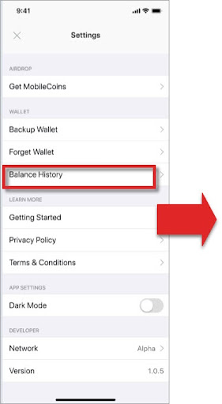
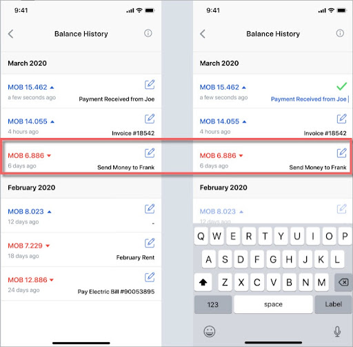

# Check transaction status (for sender)

### User experience

Senders can check their transaction status on their smartphone’s MobileCoin wallet app by looking up their balance history in the app's _Settings_:

 

### Implementation

As an Android developer, you will need the following code to enable the user to check their transaction status:

```java
mobileCoinClient
.postTransaction(pendingTx);
status = client
.getTransactionStatus(pendingTx);
```


The code provided by the MobileCoin SDK enables the users to access a secure, pre-processed version of their data on the MobileCoin Ledger in MobileCoin Fog Services through their mobile wallet app.

