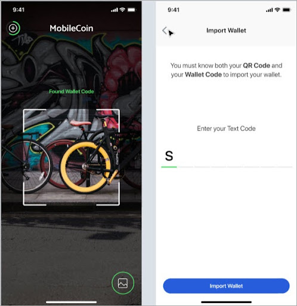
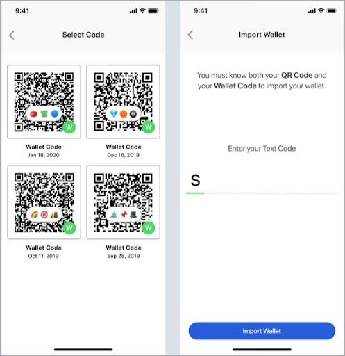

# Create an account key

### User experience

In order for new users to create a MobileCoin wallet on their smartphone, they must add an [**account key**](../glossary.md) by importing an account or adding a QR Code using their device's photo library.

 

### Implementation

As an Android developer, you need the following code to enable the user to create/import the account key:

```java
byte[] entropy = { /* bytes */ }
Account account =
  new Account(entropy, FOG_URI);
/* ------------------------- */
Account account =
  new Account.createNew(FOG_URI);
  ```
