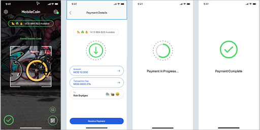

# Get balance

### User experience

In order for users to receive transactions (that is, get their balance), they must be able to deposit funds from a [**request QR Code**](../glossary.md).



### Implementation

As an Android developer, you will need the following code to enable the user to get their balance:

```java
MobileCoinClient mobileCoinClient =
new MobileCoinClient(
account,
FOG_URI,
CONSENSUS_URI
);
BigInteger balance =
mobileCoinClient.getBalance();
```
