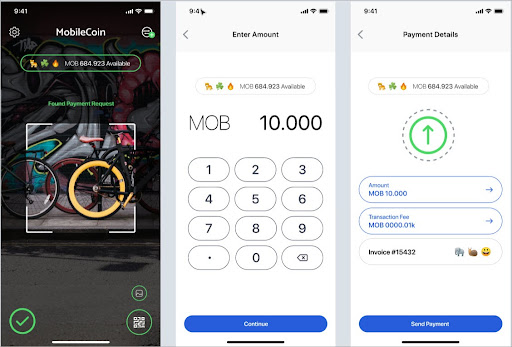

# Send transaction

### User experience

To send a transaction, users need to enter the transaction amount and send to a specific user’s public address or QR code. Users can also send a transaction to a public address that's already in their contacts.



### Implementation

Two things should be done before sending a transaction:
1. Obtain `PublicAddress` of recipient
2. Estimate total transaction fee (see [calculate-fee](https://github.com/mobilecoinofficial/android-sdk/blob/javadoc-updates/docs/dev-overview/calculate-fee.md))

The rest is fairly simple. The code provided below can be used to create and submit a transaction:

```java
PendingTransaction pendingTransaction = client.prepareTransaction(
        recipientPublicAddress,
        amountToSend,
        fee
);
client.submitTransaction(pendingTransaction.getTransaction());
```
