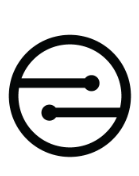

# Android Integration Guide for MobileCoin SDK

## Welcome!

We're thrilled to have you here!

In this Integration Guide you'll find all the necessary information and code examples for developing MobileCoin functionality in your custom wallet app.

If you're new to MobileCoin, we recommend reading through the rest of the content in the Dev Portal. You'll find a shorter overview in [MobileCoin overview](mobilecoin.md), as well as a [Glossary](glossary.md) with the most important terms and definitions, and a regularly updated [FAQ](faq.md).

If you're already familiar with MobileCoin, but new to developing with the MobileCoin SDK, head to the [Getting Started](getting-started.md) chapter.

For quick reference of functionality, see [Developing the code](dev-overview/).

*Happy developing!*

## Table of Contents

* [About this guide](about.md)
  * Who should read this guide
  * How to use this guide
* [MobileCoin overview](/docs/mobilecoin.md)
  * About MobileCoin
  * Understanding the MobileCoin SDK
  * Understanding MobileCoin Fog Services
  * Understanding MobileCoin Consensus Services
* [Getting started](getting-started.md)
  * MobileCoin integration requirements
* [Developing the code for the MobileCoin Wallet App](dev-overview/)
  * [Create an account key](dev-overview/create-account-key.md)
  * [Share public addresses](dev-overview/share-public-addresses.md)
  * [Get balance](dev-overview/get-balance.md)
  * [Send transaction](dev-overview/send-transaction.md)
  * [Calculate fee](dev-overview/calculate-fee.md)
  * [Check transaction status (for sender)](dev-overview/check-transaction-status.md)
  * [Transaction receipts (for recipient)](dev-overview/transaction-receipts.md)
* [Glossary](glossary.md)
* [Frequently Asked Questions](faq.md)

---

Product of MobileCoin™

_Copyright © 2021 MobileCoin™. No part of this manual may be reproduced in whole or in part without the express written permission of MobileCoin. MobileCoin reserves the right to change product design and specifications at any time without prior notice. MobileCoin™ is a trademark of MobileCoin, Inc. All company, brand, and product names are registered trademarks of their respective holders._
