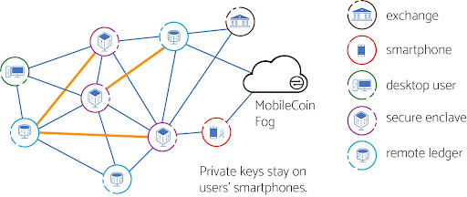
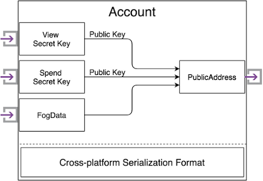

# MobileCoin Overview

### Why MobileCoin?

[MobileCoin](https://mobilecoin.com) aspires to be the most trusted payment system in the world. We designed and built our network with the most secure open-source protocols available. Our encrypted payments are created using secret keys that never leave the user’s device.

## About MobileCoin

The MobileCoin Network is an open-source software ecosystem that introduces several innovations to the cryptocurrency community, including:

* **MobileCoin Ledger**: a new privacy-preserving blockchain built on a technology foundation that includes CryptoNote and Ring Confidential Transactions (RingCT);
* **MobileCoin Consensus Protocol**: a high-performance solution to the Byzantine Agreement Problem that allows new payments to be rapidly confirmed rapidly;
* **Secure Enclaves**: trusted execution environments using Intel’s Software Guard eXtensions (SGX) to provide defense-in-depth improvements to privacy and trust;
* **MobileCoin Fog**: a scalable service infrastructure that enables a smartphone to manage a privacy-preserving cryptocurrency with locally- stored cryptographic keys;
* **MobileCoin SDK**: a layer with all of the business logic and cryptographic operations required to interact with MobileCoin Fog from a mobile wallet application; and
* **Custom mobile wallet apps**: software wallets that reside on users’ smartphones ensuring privacy while enabling transactions to occur.

## The MobileCoin SDK architecture

View, Ledger, and Consensus services use Intel’s SGX enclaves, so clients must establish attested connections to these services. The MobileCoin SDK handles the logic for attestation.

The _View Server_ enables users to view their transactions and get their balances.

The _Ledger Server_ allows users to get “materials” to construct new private transactions. These materials include other _transaction outputs_ ([**TxOuts** or “_mixins_](glossary.md)) and [**Merkle Proofs of Membership**](glossary.md). Each TxOut is like a coin, where every transaction uses TxOuts as inputs to create new TxOuts as the outputs of a transaction.


MobileCoin preserves the privacy of the sender by mixing in random coins from the ledger ([_mixins_](glossary.md)), with the coins the user wants to spend. A Merkle Proof of Membership is provided with each _mixin_ as proof that the input is included in the MobileCoin Ledger, so that new coins cannot be forged.


## Understanding the MobileCoin SDK

MobileCoin has developed an SDK for developers to get started quickly in developing a custom mobile wallet app, without having to write the code for the business logic or cryptographic operations. The MobileCoin SDK connects to MobileCoin’s **Fog Services** as well as the **Consensus Service**.

The three most important steps to implementing a MobileCoin wallet app on your messaging service include:

1. _Managing account keys_: The custom mobile app must manage the account keys for the users’ smartphone wallet.
2. _Sending transactions_: The app must be able to receive Fog data, such as view and spend information.
3. _Checking balances_ and _receiving transactions_: The app must be able to connect to the Consensus Server to send and validate new transactions.

A user's **account key** consists of secret keys as well as public addresses.

The _view secret key_ allows the user to decrypt received transactions uniquely, while the _spend secret key_ provides spend authority over the user's MOB.

The public components of the view and spend keys create the _public address_, which a user can provide to others in order to receive MOB.

In addition, **FogData** (see below) is included in the account key so that mobile users can transact without needing to download the entire ledger. This FogData is available through the _public address_, and is required in order to receive MOB on a mobile device. The SDK also provides _cross-platform serialization formats_, so that wallets can communicate public addresses and transaction materials across different platforms.

## Understanding MobileCoin Fog Services

MobileCoin **Fog Services** enable users to look up their transactions quickly.

By providing this service, MobileCoin has developed a unique ledger that is different from the public ledger. This unique ledger, based in the Fog, enables users to view a portion of their transactions by using the View Server. The Fog Services also ensure that the users’ transaction information remains oblivious to others.

## Understanding MobileCoin Consensus Services

The MobileCoin **Consensus Service** allows new payments to be rapidly confirmed rapidly by providing a high-performance solution through Byzantine Fault Tolerant (BFT) consensus algorithms.

This rapid confirmation offers the ability for cryptocurrency to be used on smartphones. By incorporating the **Stellar Consensus Protocol**, MobileCoin removed the work-intensive cryptocurrency miners, which made everyday transactions difficult. By transferring the consensus verification of the blockchain transactions to a trusted MobileCoin consensus network built on trusted business relationships, MobileCoin has improved latency rates and transaction rates to make everyday transactions on smartphones a reality.
